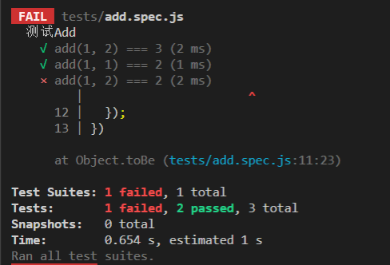

#### vite搭建开发环境

##### 包管理工具

- pnpm优势
  
  1. 优秀的管理机制，安装依赖迅速且节省空间
     当使用npm或者yarn时，多个项目依赖同一个包，每个项目都会创建一次，而pnpm，依赖项将存储在一个内容可寻址的仓库中，所有文件都会从同一位置创建硬链接，不会占用额外的磁盘空间，允许跨项目共享同一版本依赖。
  2. pnpm拥有良好的workspace功能可以很好完成monorepo风格的项目管理
     pnpm内置了对monorepo的支持，只需在工作空间的根目录创建pnpm-workspace.yaml和.npmrc配置文件，同时还支持多种配置，相比较lerna和yarn workspace，pnpm解决monorepo的同时，也解决了传统方案引入的问题。

- 项目搭建步骤
  1. 使用pnpm初始化项目

    ```csharp
    pnpm init
    ```

  2. 安装vite作为开发工具

    ```kotlin
    pnpm i vite@3.0.7 -D
    ```

  3. 创建index.html用于测试

##### 开发Vue组件

- 安装vue3.0

  ```kotlin
  pnpm i vue@3.2.37
  ```

- 创建index.ts，并在index.html中引入
- 创建button/index.tsx用于创建button组件
- vue3.0默认不支持模板编译，所以不能使用template语法，需要安装plugin-vue插件以支持单文件组件的编译
  1. 安装vite的vue插件

     ```kotlin
     pnpm i @vitejs/plugin-vue -D
     ```

  2. 添加vite.config.ts，配置plugin

     ```ts
     // vite.config.ts
     import { defineConfig } from "vite";
     import vue from "@vitejs/plugin-vue";

     // https://vitejs.dev/config/

     export default defineConfig({
       plugins: [vue()],
     });
     ```

  3. 创建vue组件测试
     引用时如果不添加模块类型定义，会导致引入vue组件时报错

     ```ts
     // src/shims-vue.d.ts
     declare module "*.vue" {
      import { DefineComponent } from "vue";
      const component: DefineComponent<{}, {}, any>;
      export default component;
     }
     ```

##### JSX组件

想要支持JSX语法，就必须通过babel转义工具的支持

- 安装插件

```kotlin
pnpm i @vitejs/plugin-vue-jsx@"2.0.0" -D
```

- 配置vite.config.ts，添加plugins的JSX插件
- 直接使用jsx语法会报错，找不到名称“React”，这是不支持JSX语法造成的，而不是需要安装React，只需要配置tsconfig.json对jsx语法的支持

  ```json
  {
    "compilerOptions": {
      "declaration": true /* 生成相关的 '.d.ts' 文件。 */,
      "declarationDir": "./dist/types" /* '.d.ts' 文件输出目录 */,
      "jsx": "preserve"
    },
    "include": ["./**/*.*", "./shims-vue.d.ts"],
    "exclude": ["node_modules"],
    "esModuleInterop": true,
    "allowSyntheticDefaultImports": "true"
  }
  ```

##### 库文件封装

一般像Element这种组件库都支持两种方式引入组件

- 完整引入，以vue插件的形式

  ```ts
  import Element from 'element-ui'

  // 完整引入
  Vue.use(Element)

  import {
    Select,
    Button
    // ...

  } from 'element-ui'

  // 按需引入
  Vue.component(Select.name, Select)
  ```

- 按需引入，导出单个文件，使用`vue.component`注册

所以组件库需要包含两个要求：

1. 默认导出为Vue插件
2. 每个组件可以单独导出

###### 封装过程

1. 设计入口
   - 导出全部组件
   - 实现一个Vue插件，插件种编写install方法，将所有组件安装到vue实例中

    ```ts
    // src/entry.ts
    import { App } from 'vue';
    import MyButton from './button';
    import SFCButton from './button/SFCButton.vue';
    import JSXButton from './button/JSXButton';
    // 导出单独组件 以支持按需引入
    export { MyButton, SFCButton, JSXButton }

    // 编写一个插件，实现一个install方法
    export default {
      install(app: App): void {
        app.component(MyButton.name, MyButton);
        app.component(SFCButton.name, SFCButton);
        app.component(JSXButton.name, JSXButton);
      }
    }
    ```

2. 配置vite.config.ts，以支持库文件的封装

   ```ts
    const rollupOptions = {

      external: ["vue", "vue-router"],
      output: {
        globals: {
          vue: "Vue",
        },
      },

    };

    export default defineConfig({

      .....  

      // 添加库模式配置

      build: {
        rollupOptions,
        minify:false,
        lib: {
          entry: "./src/entry.ts",
          name: "SmartyUI",
          fileName: "smarty-ui",
          // 导出模块格式
          formats: ["esm", "umd","iife"],
        },
      },
    });

   ```

3. package.json中添加build命令，打包库文件
4. 引入在demo文件中进行测试

### CSS样式：用UnoCSS实现原子化css

> 给组件库添加样式系统，让组件库拥有一套统一风格的样式

##### 「Atomic/Utility-First CSS」与「Semantic CSS 」的选择

- 每个组件库有一套样式系统，确保样式风格统一，ElementUI遵循「Semantic CSS 」(语义化CSS)
- 组件库通常需要搭建一个CSS子工程，用于实现类型系统 Element基于Sass + Gulp搭建
- 原子样式出现后，无需搭建样式系统也能完成类似效果

##### AtomicCss

原子样式，代表作TailwindCSS，所提供的样式系统，很好的降低了UI库的开发难度

##### UnoCSS实现AtomicCSS

- [TailWind](https://tailwindcss.com/docs/installation) /ˈteɪlwɪnd/虽然好，缺点性能不足，会生成大量样式定义，全量CSS文件往往体积很大，导致页面性能下降
- [UnoCSS](https://github.com/unocss/unocss) 拥有高性能且具灵活性的即时原子化CSS引擎，兼顾产物体积和开发性功能
  
##### 引入UnoCSS

1. 引入UnoCSS

   ```kotlin
   pnpm i -D unocss@"0.45.6"
   pnpm i -D @iconify-json/ic@"1.1.4"
   ```

2. vite.config.ts添加插件

   ```ts
    import { presetUno, presetAttributify, presetIcons } from "unocss";
    import Unocss from "unocss/vite";
    export default defineConfig({
      plugins: [
        ...
        // 添加UnoCSS插件
        Unocss({
            presets: [presetUno(), presetAttributify(), presetIcons()],
        })
      ],
    });
   ```

3. 使用以src/button/index.tsx为例
4. 在index.ts中使用，注意createApp引入需要从`vue/dist/vue.esm-bundler.js`中引入，正常显示后说明UnoCSS正常引入

##### 实现组件属性定制按钮样式

- 根据color属性定制颜色
  UnoCSS默认按需生成方式，也就是只生成代码中使用过的样式，如果在class中使用变量，无法分析变量的取值，也就无法动态生成样式<br />
  解决问题：引入Safelist安全列表选项，把样式定义中变量的取值添加到Safelist中，Unocss就会根据Safelist生成样式<br />

  步骤：
  1. 创建config/unocss.ts，因为会大量设置Safelist，单独拆除unocss，最后引入vite配置中
  2. 导出Unocss，并引入到vite中去

##### Icon图标按钮实现

UnoCSS引入图标，加载@unocss/preset-icons预设就可以，从[iconfy](https://icones.js.org/)引入<br />

1. 在unocss.ts中增加presetIcons预设
2. 需要将使用的图标名称添加到safelist中
3. 在组件中使用

### 组件使用文档

#### 使用vitepress搭建组件文档

##### 配置vitepress

1. 安装

   ```kotlin
   pnpm i vitepress -D
   ```

2. 配置vite.config.js

   不用配置vite.config.js即可使用，因为要支持jsx语法以及unoCss，则需要引入相应的插件

   ```js
    import { defineConfig } from "vite";
    import vueJsx from "@vitejs/plugin-vue-jsx";
    import Unocss from "../config/unocss";
    // https://vitejs.dev/config/

    export default defineConfig({
      plugins: [
        // 添加JSX插件
        vueJsx(),
        Unocss(),
      ],
    });
   ```

3. 创建index.md看效果
4. 配置菜单
   创建docs/.vitepress/config.ts，配置菜单
5. 组件 Demo 展示
   文档展示Demo，实际就是引入组件到markdown中。因为markdown可以直接运行html代码，viteperss含有vue实例，可以直接运行vue代码<br/>
   问题：如何加载组件库
   - 创建.vitepress/theme/index.ts，并在enhanceApp中注册组件
   - markdown使用组件
6. 引入Demo演示插件优化阅读体验
   效果：同时展示代码和UI，如element等组件库使用markdown语法，使用开源项目模仿<br/>
   - 安装插件`pnpm i vitepress-theme-demoblock -D`
   - 配置vite.config.ts，添加插槽
   - 在theme/idex中注册vitepress-theme-demoblock插件所需要的demo和demo-block组件
   - 修改button/index.md文档，添加Demo插槽

#### Jest

> Facebook开发的测试框架，用于创建、运行和编写测试的javaScript库
> 可以运行在任何javaScript项目中
> 集成断言库、mock、快照测试、覆盖率报告
> Vue3.0及ElementUI都是jest完成的单元测试

- 安装：全局安装即可

  ```kotlin
  pnpm i jest -g
  ```

- jest约定
  1. 功能函数对应的测试函数放在tests目录中
  2. 测试函数文件名为fun.spec.js

- 编写测试用例
  1. 创建/tests/add.spce.js
  2. 建立describe测试分组，在第一个参数中填写测试内容
  3. 编写测试代码test函数，每一个test函数是一个测试case：使用 expect（运行结果）.toBe（期望结果）的形式编写断言

- 执行jest命令测试，jest自动运行tests下的所有用例
  

##### Mock模拟无法执行的函数

Mock 函数的作用，就是为了有效孤立函数，实现真正的单元测试。<br />

被测试代码调用网络请求API，或者测试函数中包函数，这种问题如何处理？<br />

单元测试是针对开发的最小单元进行测试，也就是函数，如果遇到函数A调用函数B时，应该直接模拟B函数返回结果，不测试B函数，如下面代码

```js
// fetch.js
const axios = require('axios')
exports.getData = () => axios.get('/abc/bcd')
```

不用管`axios.get`，只需要模拟一个axios.get返回相应的结果，使用jest.mock模拟

##### 测试前端页面

前端页面包含DOM模型，而Node中没有DOM模型，需要通过jsdom模拟一个dom对象

1. 安装jsdom

   ```kotlin
   pnpm i jsdom -D

   ```

2. 编写jsdom-config.js
3. 编写测试函数

### 搭建Vitest单元测试环境

- Vitest基于vite，与vite通用配置；如果在vite中配置插件支持JSX语法，单元测试时就无需在配置一遍
- Vitest兼容大部分jest使用方法
- vitest注重性能，尽可能多的使用Worker线程并发执行

- 安装

  ```kotlin
  pnpm i -D vitest happy-dom @vue/test-utils
  ```

  - vitest：测试框架，用于执行整个测试过程并提供断言库、mock、覆盖率报告
  - happy-dom：用于提供Node环境中的Dom仿真模型
  - @vue/test-utils工具库：Vue推荐的测试工具库

- vite.config.ts配置Vitest配置
  
  - enviroment配置happy-dom，用于测试所需要的DOM对象的仿真
  - transformMode，TSX、JSX转换处理

- 修改package.json文件添加test脚本

- 编写测试用例
  在src/button/test下添加Button.test.ts
  
### Eslint + Prettier + Husky

#### 编码规范

#### 目录规范

```bash
.
├── config               # 配置文件
├── coverage            # 覆盖率报告
├── demo                # 代码范例
├── docs                # 文档
├── node_modules  
├── scripts              # 脚本 发布、提交信息检查
├── src                  # 组件代码
└── types                # TS类型定义
```

#### 文件命名规范

```bash
├── src                 # 组件代码
    └── button       # 组件包名
         ├── index.ts   # 组件入口
         ├── Button.tsx  # 组件代码  
         └── __tests__   # 测试用例
                  └── Button.spec.ts   
```

- 包名：小写 + 中划线
- 统一入口文件： index.ts
- 组件代码： 大驼峰
- 测试用例代码 ： 测试对象名+ .spec.ts

#### Eslint + Prettier代码检查工具

- eslint专注代码语法检查，prettier专注代码格式调整

  ```bash
    pnpm i eslint -D
    # ESLint 专门解析 TypeScript 的解析器
    pnpm i @typescript-eslint/parser -D
    # 内置各种解析 TypeScript rules 插件
    pnpm i @typescript-eslint/eslint-plugin -D

    pnpm i eslint-formatter-pretty -D
    pnpm i eslint-plugin-json -D
    pnpm i eslint-plugin-prettier -D
    pnpm i eslint-plugin-vue -D
    pnpm i @vue/eslint-config-prettier -D
    pnpm i babel-eslint -D
    pnpm i prettier -D
    ```

- 创建.tslintrc.cjs添加配置文件
- 添加.eslintignore忽略文件
- package.json配置检查脚本

#### Husky + git hooks 自动化提交验证

git本身有钩子，但设置较复杂，一般使用husky来简化配置

```bash
pnpm i husky -D
```

### 软件包封装

#### 考虑支持哪些模块规范

成熟的类库都支持cjs、esm、umd等多种模式

- ESM：常见的前端开发标配
- CJS：CommonJS标准的模块化
- IIFE：适用于逻辑简单、无需搭建工程化环境的前端应用

#### 考虑代码压缩和混淆问题

- 代码压缩：去除代码中的空格、制表符、换行符等内容，将代码压缩到一行或多行，提高网站加载速度
- 代码混淆：功能等价，但难以阅读和理解，目的是增加反向工程的难度，同时可以相对减少代码的体积

#### sourceMap配置

json文件，维护打包前后代码的映射关系，如果需要调试的话需要配置sourceMap

### vite配置

```ts
/**
 * vite构建通过rollup完成 
 * rollup的配置通过rollupOptions传递
 * external： 将该模块保留在 bundle 之外，代码中使用第三方库vue，但不想让vue出现在打包结果中
 * output： 用于 umd/iffe 包中，意思是全局中的某个模块在组件库中叫什么名字
 */
const rollupOptions = {
  external: ["vue"],
  output: {
    globals: {
      vue: "Vue",
    },
  },
};
export default defineConfig({
 build: {
    rollupOptions,
    minify: 'terser', // boolean | 'terser' | 'esbuild' 是否开启混淆 两个混淆工具  terser、esbuild
    sourcemap: true, // 输出单独 source文件
    brotliSize: true,  // 生成压缩大小报告
    cssCodeSplit: true,
    lib: {
      entry: "./src/entry.ts",
      name: "SmartyUI", //  生成包的名字，在 iife/umd 包，同一页上的其他脚本可以访问它
      fileName: "smarty-ui", // 输出文件名的前缀，和模块类型配合组成最终的文件名
      formats: ["esm", "umd", "iife"], // 导出模块类型
    },
  },
});
```

如果使用terser，则需要安装terser

```bash
pnpm i terser@"5.4.0" -D
```

通过yarn build进行打包

测试IIFE代码 demo/iife/index.html

### 持续集成CI

开源项目使用第三方实现持续集成，例如Github Action、Travis CI、CircleCI

#### Github Action

集成服务，可以理解为远程运行的服务器，使用虚拟机配置容器使得一台服务器为不同用户提供独立的配置

#### 创建workflow

- .github/workflows Github Action配置文件
- 每个文件对应一个工作流workflow
- 一个workflow可以配置多个job\
- job包含runs-on和steps
- steps包含多个step，每个step串行执行，step可以使用三种方式：
  - run： 执行 shell 命令行命令，如执行pnpm run dev，可以设置成  run: pnpm run dev
  - env:  设置环境变量
  - uses：运行第三方 [Action 脚本](https://github.com/marketplace?type=actions&query=actions)，Action脚本是Github提前写好的一些常用脚本
  
  文件结构如下：

  ```yaml
  name: CI # 最终展示在到Github Action 的执行界面
  on:      # 触发器 何时运行这个工作流 如 Github 收到 push 代码时和 pull_request 请求时触发工作流
    push:
      branches: [ main ]
    pull_request:
      branches: [ main ]
  jobs: # 任务
    Lint: # Lint任务
      runs-on: ubuntu-latest # 指定运行环境
      # 步骤表示将作为作业的一部分执行的一系列任务
      steps:
    UnitTest:
      # 单元测试任务
  ```

